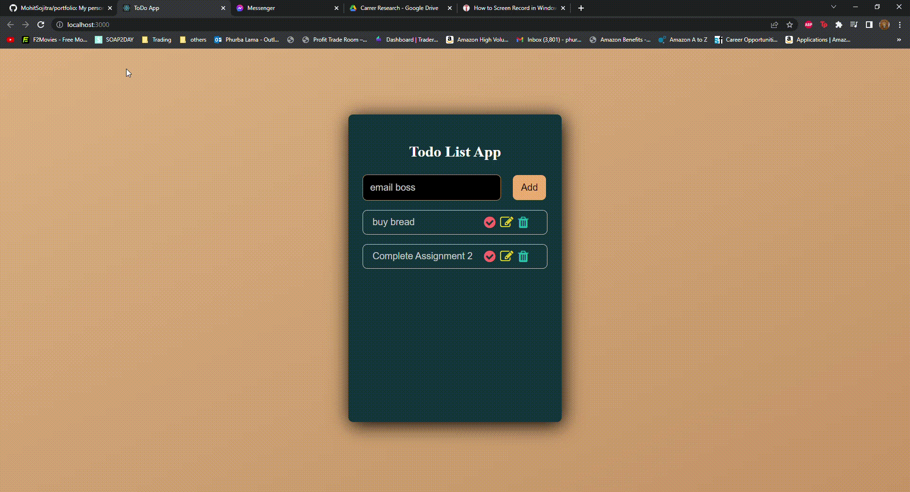

### Todo List app 

## Description
This application helps you keep track of your task and things to do for the day. Each list has its own controls to cross out a list when done, edit the task text and trash it to remove the list. For this application the data are stored in the local storage in localhost:3000. This application was created using React.js and CSS. 

## Features
- Add to-do list
- Edit to-do list
- Delete to-do list
- saved in local storage (localstorage:3000)
--

--

--
## Technologies
- React (Frontend View Framework)
- React Hooks (useState, useEffect)
- CSS (styling the app)
- Node (npm)
- Visual Studio Code (JavaScript IDE)
